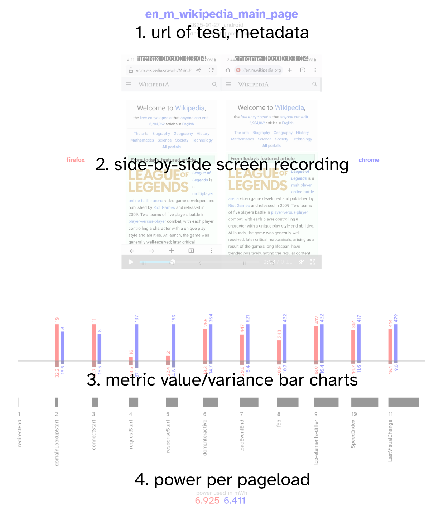

# page annotated

## 1
Three lines of text, the first is the test name, which is clickable to the URL being tested. The second is the date of the test, and the operating stystem used to test the browser (mac, linux, android, windows). The third line contains attributes of the page content, and optimizations like 'rel=preload' used to enhance performance.

## 2
Side by side video of firefox on the left and chrome on the right. Controls to play/pause are on the bottom of the video frame.

## 3
Progressive page load glyph. Twelve metrics arranged from left to right, with metrics closer to the left occurring closer to the start of page load, and metrics to the right occurring closer to the end of page load. Each metric has a vertical group consisting of three sections. One, a top bar chart of the metric values, in milliseconds. Firefox is in red and to the left, chrome is in blue and to the right: these metrics are scaled in relation to each other, but not the other metrics. Two, below the horizontal rule, is the relative standard deviation, a measure of variance, as a percentage from 0-100. Three, a number and name for the metric next to a variable-sized black rectangle that gets larger as the metrics progress from left to right. Lower is better.

## 4
Power used by the browser to complete the page load, in mWH (milli watt hours). Lower is better.
